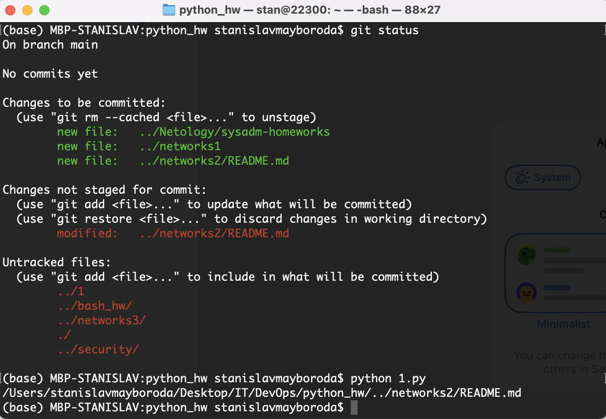
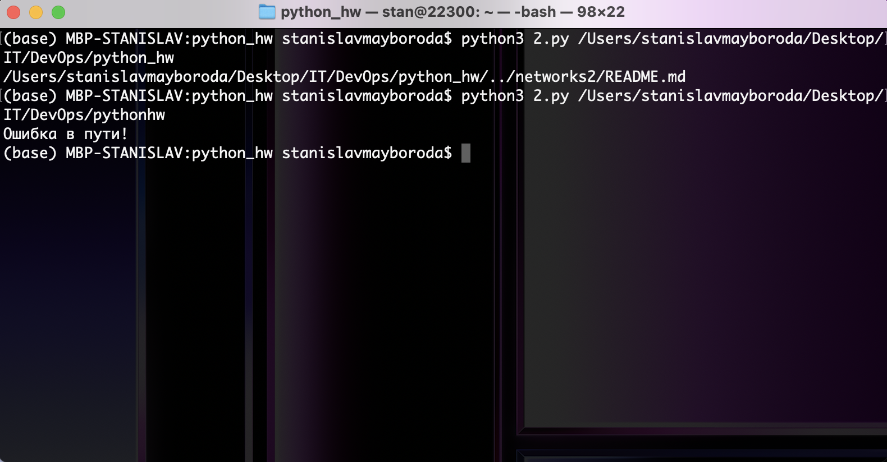
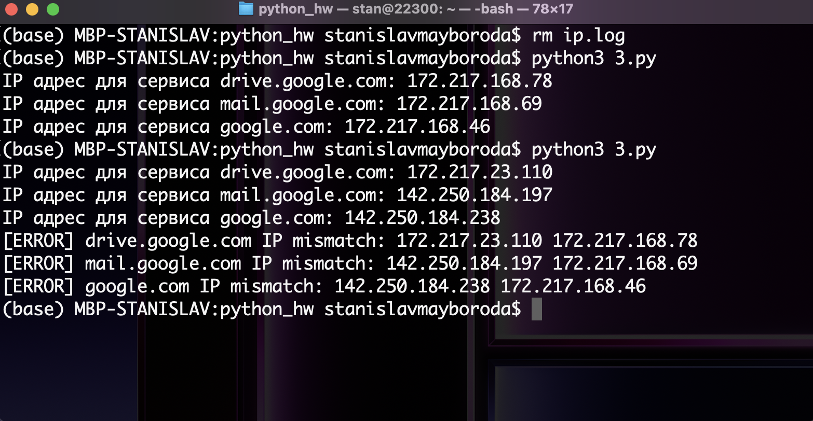

# Домашнее задание к занятию «Использование Python для решения типовых DevOps-задач»

1. Есть скрипт:

```
#!/usr/bin/env python3
a = 1
b = '2'
c = a + b
```

* Какое значение будет присвоено переменной c?

Результатом будет ошибка исполнения, так как a и b имеют разные типы данных: a - int, а b - str

* Как получить для переменной c значение 12?
Необходимо привести a к типу str и выполнить операцию конкатенации:
c = str(a) + b

* Как получить для переменной c значение 3?	
Необходимо сложить целые числа:
c = a + int(b)


1. Мы устроились на работу в компанию, где раньше уже был DevOps-инженер. Он написал скрипт, позволяющий узнать, какие файлы модифицированы в репозитории относительно локальных изменений. Этим скриптом недовольно начальство, потому что в его выводе есть не все изменённые файлы, а также непонятен полный путь к директории, где они находятся.

Как можно доработать скрипт ниже, чтобы он исполнял требования вашего руководителя?

```
#!/usr/bin/env python3

import os

bash_command = ["cd ~/netology/sysadm-homeworks", "git status"]
result_os = os.popen(' && '.join(bash_command)).read()
is_change = False
for result in result_os.split('\n'):
    if result.find('modified') != -1:
        prepare_result = result.replace('\tmodified:   ', '')
        print(prepare_result)
        break
```

Ответ:
```
import os

repo_path = '/home/repo/netology/sysadm-homeworks/'

bash_command = ["cd " + repo_path, "git status"]

result_req = os.popen(' && '.join(bash_command)).read()

for result in result_req.split('\n'):
    if result.startswith('\tmodified:'):
        output = os.path.join(repo_path, result.replace('\tmodified:', '').strip())
        print(output)
```



1. Доработать скрипт выше так, чтобы он не только мог проверять локальный репозиторий в текущей директории, но и умел воспринимать путь к репозиторию, который мы передаём, как входной параметр. Мы точно знаем, что начальство будет проверять работу этого скрипта в директориях, которые не являются локальными репозиториями.

```

#!/usr/bin/env python3

import os, sys

repo_path = sys.argv[1]

if not os.path.exists(repo_path):
    print(f'Ошибка в пути!')
    sys.exit(1)

if not os.path.isdir(repo_path):
    print(f'Это не директория!')
    sys.exit(1)

bash_command = f"git -C {repo_path} status"

result_req = os.popen(bash_command).read()


for result in result_req.split('\n'):
    if result.startswith('\tmodified:'):
        output = os.path.join(repo_path, result.replace('\tmodified:', '').strip())
        print(output)
```



4. Наша команда разрабатывает несколько веб-сервисов, доступных по HTTPS. Мы точно знаем, что на их стенде нет никакой балансировки, кластеризации, за DNS прячется конкретный IP сервера, где установлен сервис.

Проблема в том, что отдел, занимающийся нашей инфраструктурой, очень часто меняет нам сервера, поэтому IP меняются примерно раз в неделю, при этом сервисы сохраняют за собой DNS-имена. Это бы совсем никого не беспокоило, если бы несколько раз сервера не уезжали в такой сегмент сети нашей компании, который недоступен для разработчиков.

Мы хотим написать скрипт, который:

опрашивает веб-сервисы;
получает их IP;
выводит информацию в стандартный вывод в виде: <URL сервиса> - <его IP>.
Также должна быть реализована возможность проверки текущего IP сервиса c его IP из предыдущей проверки. Если проверка будет провалена — оповестить об этом в стандартный вывод сообщением: [ERROR] <URL сервиса> IP mismatch: <старый IP> <Новый IP>. Будем считать, что наша разработка реализовала сервисы: drive.google.com, mail.google.com, google.com.

Ответ:

```
import os, socket

cur_dir = os.getcwd()
path = cur_dir+"/ip.log"

urls = {
    "drive.google.com": None,
    "mail.google.com": None,
    "google.com": None
}

for u in urls:
    ip = socket.gethostbyname(u)
    urls[u] = ip
    print(f"IP адрес для сервиса {u}: {ip}")


if not os.path.isfile(path):
    with open(path,"w") as file:
        for u in urls:
            file.write(f"{urls[u]}\n{u}\n")
    file.close()
else:
    with open(path, "r+") as file:
        old_ips = file.read().splitlines()

        for u in urls:
            if urls[u] not in old_ips:
                print(f"[ERROR] {u} IP mismatch: {urls[u]} {old_ips[old_ips.index(u)-1]}")

        file.seek(0)
        file.truncate(0)

        for u in urls:
            file.write(f"{urls[u]}\n{u}\n")
    file.close()
```

